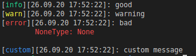

## Dependencies
- [python 3.x](https://www.python.org/downloads/)
- python3-pip (comes with python3 installation)

# Forget print()
You will never use print, sleep, mailing, or file handling again. prology was build with <3 to serve not only as a fancy console logger but also as a wise assistant within your python project and should save massive time when importing or writing commonly used routines. The prology logging goes beyond python, yet it may log every input event, and system wide as well. Not convinced? Give the following 3 code lines a try:

```python
print('common printing ...')
```
```bash
>>> common printing ...
```

```python
from prology import logger as log
log.note('fancy printing!')
```

```bash
>>> [info][26.09.20 14:39:23]: fancy printing!
```

<br>

# Getting Started

## Installation
Install the prology package system wide within seconds. Switch into the project root directory and type

```bash
~ prology/$ pip3 install .
```

After installation import prology into your custom python `/project/` or file

```python
from prology import logger
log = logger()
```
<br>

## Hello World in prology 

<br>

``` python
log.note('Hello World!')
```
```bash
~ /project/$ [info][26.09.20 14:39:40]: Hello World!
```

<br>

## Logging

<br>

Every [logger.note]() call internally creates a [block]() object - an editable string which can be customized using keyword argurments. This block by default yields a date-/[timestamp]() and a [logType]() block indicating error, warning, info or some custom type, and it can be printed (default), saved (if a filepath was provided), forwarded to other functions (if forwarder was provided), send a mail containing the block or the raw input and many [more]().<br>
Save your printing blocks using a new logger instance
``` python
log = logger('./log.txt', overwrite=True)
logger.note('This will be appended in the log file')
logger.note('This will be appended as well')
```
every note call called from this logger will be printed if `detatch` flag is False (default) and be logged into the provided path. The root-directory is always the current working directory see [os.getcwd()]() which is your `/project/` directory.
```
~ /project/$ nano log.txt

[info][26.09.20 13:58:42]: This will be appended in the log file
[info][26.09.20 13:58:42]: This will be appended as well
```

You have a large project with many cross imports or chained function calls? You are bored searching for bugs in a call chain? <br> No worries! **prology** keeps track of the function branch from which the `logger.note` method was called.

```python
def brokenFunction():

    try:

        raise ValueError('This Function has errors')

    except Exception as err:

        log.note(err, logType='error', fTree=True, wait=1)

def parentCaller():

    return brokenFunction()

def grandParentCaller():

    return parentCaller()

grandParentCaller()

```

```
[error][26.09.20 16:21:52][call tree: grandParentCaller > parentCaller > brokenFunction > error]: This Function has errors
        Traceback (most recent call last):
          File "test.py", line 9, in brokenFunction
            raise ValueError('This Function has errors')
        ValueError: This Function has errors

```

In the above example the block contains the function tree [fTree]() which allows you to see the calling branch and the original input but also the exception
is appended and logged as well into the `log.txt`.

<br>

# Usage `prology.`

## **logger**(***filepath***=None, ***overwrite***=False) [object]
Main object for logging.<br>
- **filepath [kwarg] (str)** <br>
*Default: None* <br>
Provide a filepath to which to log. Absolute and relative paths as well as custom file extensions are possible. The root path is the current working directory. <br>
- **overwrite [kwarg] (bool)** <br>
*Default: False* <br>
Overwrite the file. If enabled you can call several logger instances from plenty apps which will all append logs to the same file but make sure to give every logger instance a custom [logType]() to distinguish them. <br>

<br>

### **logger.note**(***input***='', ***inputCol***=None, ***logType***='info', ***logTypeCol***=None,***showExcept***=True, ***timestamp***=True, ***fTree***=False, ***benchMark***=None, ***detatch***=False, ***save***=True, ***deliverTo***=None, ***subject***=None, ***wait***=None, ***forward***=True, ***forwardBlock***=False) [method] 
Main method for logging. The options can be altered via the arguments.The created note creates a block and may inject e.g. a logType block, sleep timer, or forward it to another object.<br>

- **input [kwarg] (object)** <br>
*Default: str('')* <br>
The object which should be outputted. The provided object will be formatted into a string and added to the block. <br>

- **inputCol [kwarg] (str)** <br>
*Default: None* <br>
Color in which the terminal should print your input. If `None` the output will be standard white. Otherwise provide a color code such as `'\033[93m'` which is red. <br>

- **logType [kwarg] (str)** <br>
*Default: 'info'* <br>
Creates the provided string within brackets `[logType]` at the beginning of the block. The provided strings `info`, `warn`, `error` set pre-defined colors green, yellow, red, respectively. If you provide a string different from those three you can customize the color by the [logTypeCol]() argument.<br>
**Example:** <br>
    ```python
    log = logger()
    log.note('good', logType='info')
    log.note('warning', logType='warn')
    log.note('bad', logType='error')
    # custom type
    log.note('custom message', logType='custom', logTypeCol='\033[94m')
    ```
    <br>
    The red error logType will show the last catched exception unless the [showExcept]() is disabled.

- **logTypeCol [kwarg] (str)** <br>
*Default: None* <br>
Same type as [inputCol](). Changes the logType color in the terminal. See example in [logType]() for better description. <br>

- **showExcept [kwarg] (bool)** <br>
*Default: True* <br>
Enable/Disable python exceptions in your block. This can be switched to True everytime there is no real python error.<br>

- **timeStamp [kwarg] (bool)** <br>
*Default: True* <br>
Enable/Disable date and time block in your note. By default a time stamp is printed ```[26.09.20 17:52:22]```.

- **showExcept [kwarg] (bool)** <br>
*Default: True* <br>
Enable/Disable python exceptions in your block. This can be switched to True everytime there is no real python error.<br>

- **fTree [kwarg] (bool)** <br>
*Default: False* <br>
Enable/Disable the call tree printing in your note. See the [getting started]() for better instance. The following call tree will be added to your note ```[call tree: grandParentCaller > parentCaller > Function > logTypeCall]```.
If a grandParent or parent is not found (as it is not defined for example), then those will not be displayed in the block.

- **benchMark [kwarg] (callable object or function)** <br>
*Default: None* <br>
Perform a runtime benchmark test on arbitrary object or function calls. <br>
**Example**
    ```python
    log = logger()

    class testObject:

        def __init__(self):
            self.load()

        def load(self):
            log.note('loaded')
            
    log.note(benchMark=testObject)
    ```
    ```bash
    [info][26.09.20 18:39:57]: loaded
    [info][26.09.20 18:39:57][benchmark: 0.029802322387695312 ms]: 
    ```
    The initialization of this object took ~0.03 milliseconds. Per default, benchmark blocks are logged normally.

- **detatch [kwarg] (bool)** <br>
*Default: False* <br>
If enabled stdout will not be printed in console. All other processes will work normally.

- **save [kwarg] (bool)** <br>
*Default: True* <br>
If disabled this block will not be saved to the filepath. If the filepath is not provided, nothing will happen.

- **deliverTo [kwarg] (str or list)** <br>
*Default: None* <br>
Works only if the [logger.email]() method was called in advance. Provide a ```list``` with contact names or ```str``` with a single contact wo which to deliver the block via mail. Choose the subject for the mail via the argument [subject](). If ```'all'``` is provided, the block is sent to all known contacts specified in [logger.email]().<br>
**Example**
    ```python
    log = logger()
    log.mail('yourmail@provider.com', 'decrypted password', contacts={'friend':'friendmail@provider.com'}, smtpServer='provider smtp', port=587)
            
    log.note('This is an important message!', deliverTo='friend', subject='Important!')
    ```
- **subject [kwarg] (str)** <br>
*Default: None* <br>
Provide a subject for the [deliverTo]() argument. If None, the subject will be set automatically.

- **wait [kwarg] (int)** <br>
*Default: None* <br>
If activated i.e. if an integer is provided, the note call will sleep for this amount in seconds. This makes ```import time.sleep``` unnecessary.

- **forward [kwarg] (bool)** <br>
*Default: True* <br>
If enabled the input is returned.<br>
**Example** <br>
One can basically pass through the input. For this call a detatched note call which only passes the input and a second which catches the return and logs it. 

    ```python
    def foo():
        return True
    
    value = log.note(foo(), detatch=True, save=False)
    log.note(value)
    ```
    If detatch is deactivated the value will be loged twice in the console. If save is True it will be saved twice.

- **forwardBlock [kwarg] (bool)** <br>
*Default: False* <br>
Works only if [forward]() is True. If enabled the block will be forwarded, otherwise only the input will be forwarded as return.
